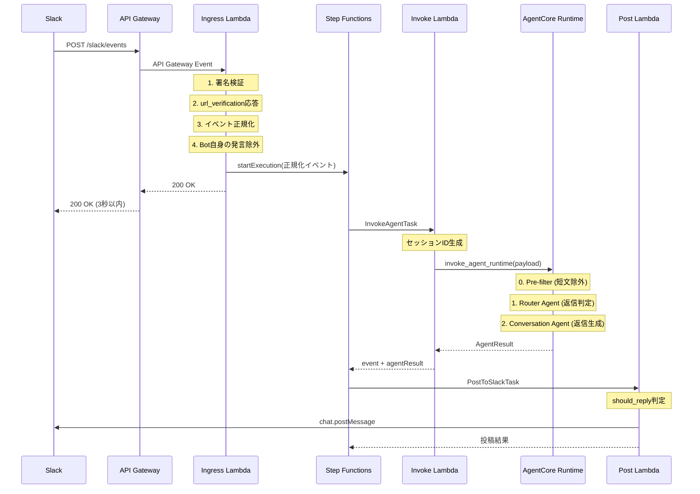

# API 仕様書

## 1. アーキテクチャフロー



---

## 2. Lambda 関数仕様

### 2.1 Ingress Lambda

**役割**: Slack Events API のエントリーポイント

#### 入力スキーマ (API Gateway Event)

```json
{
  "headers": {
    "x-slack-request-timestamp": "1234567890",
    "x-slack-signature": "v0=..."
  },
  "body": "{\"type\":\"event_callback\",\"event\":{...}}",
  "isBase64Encoded": false
}
```

#### 出力スキーマ (正規化イベント → Step Functions)

```json
{
  "team_id": "T123456789",
  "channel_id": "C123456789",
  "channel_kind": "public | private | dm",
  "user_id": "U123456789",
  "text": "メッセージ本文",
  "ts": "1234567890.123456",
  "thread_ts": "1234567890.123456",
  "is_mentioned": true,
  "is_dm": false,
  "event_type": "message"
}
```

#### フィールド説明

| Field | Type | Description |
|-------|------|-------------|
| `team_id` | string | Slack Workspace ID |
| `channel_id` | string | チャンネルID (`C`=public, `G`=private, `D`=dm) |
| `channel_kind` | string | チャンネル種別: `public`, `private`, `dm` |
| `user_id` | string | メッセージ送信者のユーザーID |
| `text` | string | メッセージ本文 |
| `ts` | string | メッセージのタイムスタンプ |
| `thread_ts` | string | スレッドのタイムスタンプ（スレッド外は`ts`と同値） |
| `is_mentioned` | boolean | Botがメンションされているか |
| `is_dm` | boolean | DMかどうか |
| `event_type` | string | イベント種別（常に`message`） |

#### 環境変数

| Variable | Description |
|----------|-------------|
| `SLACK_SIGNING_SECRET` | Slack署名検証用シークレット |
| `SLACK_BOT_USER_ID` | Bot自身のユーザーID（自己発言除外用） |
| `STEP_FUNCTION_ARN` | 起動するState MachineのARN |

#### エラーハンドリング

| Status | Condition |
|--------|-----------|
| `401` | 署名検証失敗 |
| `400` | JSONパースエラー |
| `200` | 正常（url_verification含む） |

---

### 2.2 Invoke AgentCore Lambda

**役割**: Step Functions から AgentCore Runtime API を呼び出すブリッジ

#### 入力スキーマ (Step Functions から)

正規化イベント（2.1 の出力と同じ）

#### AgentCore Runtime ペイロード

```json
{
  "prompt": "ユーザーメッセージ本文",
  "metadata": {
    "slack": {
      "team_id": "T123456789",
      "channel_id": "C123456789",
      "user_id": "U123456789",
      "is_mentioned": true,
      "is_dm": false,
      "channel_kind": "public",
      "ts": "1234567890.123456",
      "thread_ts": "1234567890.123456"
    }
  }
}
```

#### 出力スキーマ

```json
{
  "team_id": "T123456789",
  "channel_id": "C123456789",
  "channel_kind": "public",
  "user_id": "U123456789",
  "text": "メッセージ本文",
  "ts": "1234567890.123456",
  "thread_ts": "1234567890.123456",
  "is_mentioned": true,
  "is_dm": false,
  "event_type": "message",
  "agentResult": {
    "should_reply": true,
    "route": "full_reply",
    "reply_mode": "thread",
    "typing_style": "none",
    "reply_text": "返信テキスト",
    "reason": "判断理由"
  }
}
```

#### セッションID生成ロジック

```
{team_id}-{channel_id}-{thread_ts}
```

- 最小33文字が必要（AgentCore要件）
- 例: `T123456789-C123456789-1234567890.123456`

#### 環境変数

| Variable | Description |
|----------|-------------|
| `AGENT_RUNTIME_ARN` | AgentCore Runtime のARN |

---

### 2.3 AgentCore Strands Handler

**役割**: Router Agent + Conversation Agent のオーケストレーション

#### 処理フロー

```
1. Pre-filter: 短文（1-3文字）でメンションなし → 即座にignore
2. Router Agent: 返信判定（構造化出力: RouterResponse）
3. Route分岐:
   - ignore → 処理終了
   - simple_reply / full_reply → Conversation Agent呼び出し
4. Conversation Agent: 返信生成（構造化出力: ConversationResponse）
```

#### RouterResponse スキーマ

```json
{
  "should_reply": true,
  "route": "ignore | simple_reply | full_reply",
  "reply_mode": "thread | channel",
  "typing_style": "none | short | long",
  "reason": "判断理由（日本語）"
}
```

| Field | Type | Description |
|-------|------|-------------|
| `should_reply` | boolean | 返信するかどうか |
| `route` | string | ルート判定: `ignore`, `simple_reply`, `full_reply` |
| `reply_mode` | string | 返信モード: `thread`（スレッド）, `channel`（チャンネル直下） |
| `typing_style` | string | 入力中表示: `none`, `short`, `long` |
| `reason` | string | 判断理由（日本語） |

#### ConversationResponse スキーマ

```json
{
  "should_reply": true,
  "route": "full_reply",
  "reply_mode": "thread",
  "typing_style": "none",
  "reply_text": "返信テキスト",
  "reason": "Full reply generated"
}
```

| Field | Type | Description |
|-------|------|-------------|
| `reply_text` | string | 実際の返信テキスト |
| （その他） | - | RouterResponseと同じ |

#### 環境変数

| Variable | Description | Example |
|----------|-------------|---------|
| `AGENTCORE_MEMORY_ID` | AgentCore Memory ID | (SSMから取得) |
| `AWS_REGION` | AWSリージョン | `ap-northeast-1` |
| `ROUTER_MODEL_ID` | Routerモデル | `global.amazon.nova-2-lite-v1:0` |
| `CONVERSATION_MODEL_ID` | Conversationモデル | `global.anthropic.claude-sonnet-4-5-20250929-v1:0` |

#### Memory 設定

```python
retrieval_config = {
    "/preferences/{actorId}": {"top_k": 5, "relevance_score": 0.7},
    "/facts/{actorId}": {"top_k": 10, "relevance_score": 0.3},
    "/summaries/{actorId}/{sessionId}": {"top_k": 3, "relevance_score": 0.5},
}
```

- `actorId`: channel_id
- `sessionId`: thread_ts（`.`を`_`に置換）

---

### 2.4 Post to Slack Lambda

**役割**: AgentResult をパースして Slack Web API で投稿

#### 入力スキーマ

2.2 の出力と同じ（event + agentResult）

#### 出力スキーマ（成功時）

```json
{
  "statusCode": 200,
  "body": {
    "posted": true,
    "channel": "C123456789",
    "ts": "1234567890.123456",
    "thread_ts": "1234567890.123456"
  }
}
```

#### 出力スキーマ（スキップ時）

```json
{
  "statusCode": 200,
  "body": {
    "posted": false,
    "reason": "should_reply is False"
  }
}
```

#### 出力スキーマ（エラー時）

```json
{
  "statusCode": 500,
  "body": {
    "posted": false,
    "error": "channel_not_found"
  }
}
```

#### 投稿ロジック

| Condition | Action |
|-----------|--------|
| `should_reply == false` | スキップ |
| `reply_text` が空 | スキップ |
| `reply_mode == "thread"` | `thread_ts`付きで投稿 |
| `reply_mode == "channel"` | チャンネル直下に投稿 |

#### 環境変数

| Variable | Description |
|----------|-------------|
| `SLACK_BOT_TOKEN` | Slack Bot OAuth Token (`xoxb-...`) |

---

## 3. Step Functions State Machine

### 定義

```json
{
  "StartAt": "InvokeAgent",
  "States": {
    "InvokeAgent": {
      "Type": "Task",
      "Resource": "arn:aws:states:::lambda:invoke",
      "Parameters": {
        "FunctionName": "invoke-agentcore",
        "Payload.$": "$"
      },
      "OutputPath": "$.Payload",
      "Next": "PostToSlack"
    },
    "PostToSlack": {
      "Type": "Task",
      "Resource": "arn:aws:states:::lambda:invoke",
      "Parameters": {
        "FunctionName": "post-to-slack",
        "Payload.$": "$"
      },
      "OutputPath": "$.Payload",
      "End": true
    }
  }
}
```

### 状態遷移

```
InvokeAgent → PostToSlack → End
```

- 両タスクとも `payloadResponseOnly: true` のためペイロードがそのまま渡される

---

## 4. 環境変数一覧

### SSM Parameter Store

| Parameter Path | Description |
|----------------|-------------|
| `/{product_id}/{stage}/slack-bot-token` | Slack Bot OAuth Token |
| `/{product_id}/{stage}/slack-signing-secret` | Slack Signing Secret |
| `/{product_id}/{stage}/slack-bot-user-id` | Slack Bot User ID |
| `/{product_id}/{stage}/agentcore-memory-id` | AgentCore Memory ID（自動生成） |
| `/{product_id}/{stage}/apigateway.url` | API Gateway URL（自動生成） |

### CDK コンテキスト

| Variable | Description | Example |
|----------|-------------|---------|
| `PRODUCT_ID` | プロダクトID | `slack-assistant` |
| `STAGE` | ステージ | `preview`, `prod` |
| `VERSION` | バージョン | `v0`, `v1` |

### Lambda 環境変数（自動設定）

| Lambda | Variable | Source |
|--------|----------|--------|
| ingress | `SLACK_SIGNING_SECRET` | SSM |
| ingress | `SLACK_BOT_USER_ID` | SSM |
| ingress | `STEP_FUNCTION_ARN` | CDK |
| invoke-agentcore | `AGENT_RUNTIME_ARN` | CDK |
| agentcore-strands | `AGENTCORE_MEMORY_ID` | SSM |
| agentcore-strands | `AWS_REGION` | CDK |
| agentcore-strands | `ROUTER_MODEL_ID` | CDK |
| agentcore-strands | `CONVERSATION_MODEL_ID` | CDK |
| post-to-slack | `SLACK_BOT_TOKEN` | SSM |

---

## 5. エラーハンドリング

### Ingress Lambda

| Error | Response | Retry |
|-------|----------|-------|
| 署名検証失敗 | 401 | No |
| JSONパースエラー | 400 | No |
| Step Functions起動失敗 | 500 | Yes（Slack側） |

### Invoke AgentCore Lambda

| Error | Behavior |
|-------|----------|
| AgentCore ClientError | `should_reply: false`, エラーコードを`reason`に記録 |
| 予期しないエラー | `should_reply: false`, エラー種別を`reason`に記録 |

### AgentCore Strands Handler

| Error | Behavior |
|-------|----------|
| Router構造化出力なし | デフォルト結果（`should_reply: false`）を返す |
| Conversation構造化出力なし | Routerの判定を維持、`reply_text`は空 |
| Pre-filter（短文） | 即座に`ignore`を返す |

### Post to Slack Lambda

| Error | Response |
|-------|----------|
| SlackApiError | 500, エラーコードを`error`に記録 |
| `reply_text`が空 | 200, `posted: false` |
